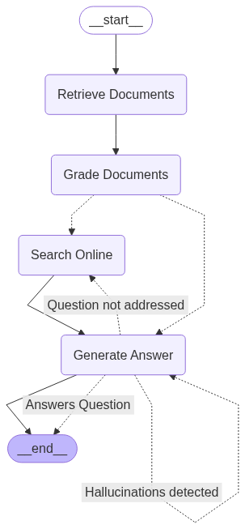
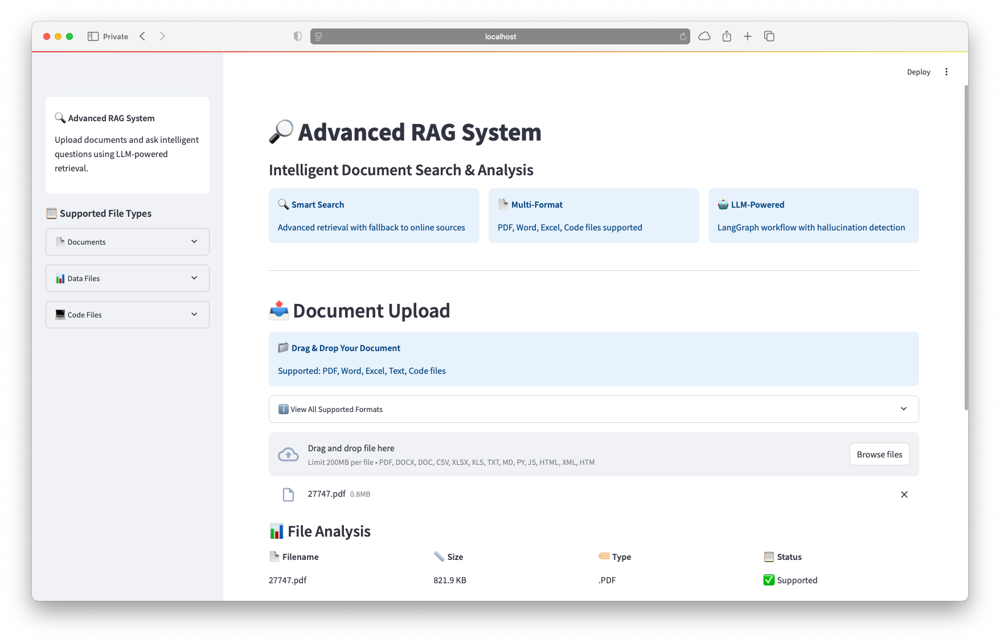
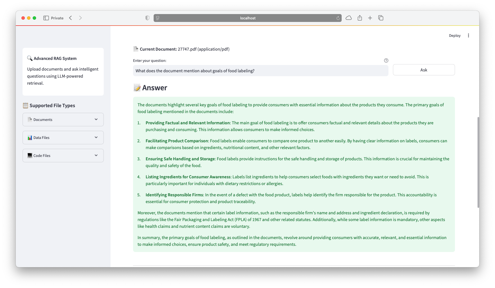
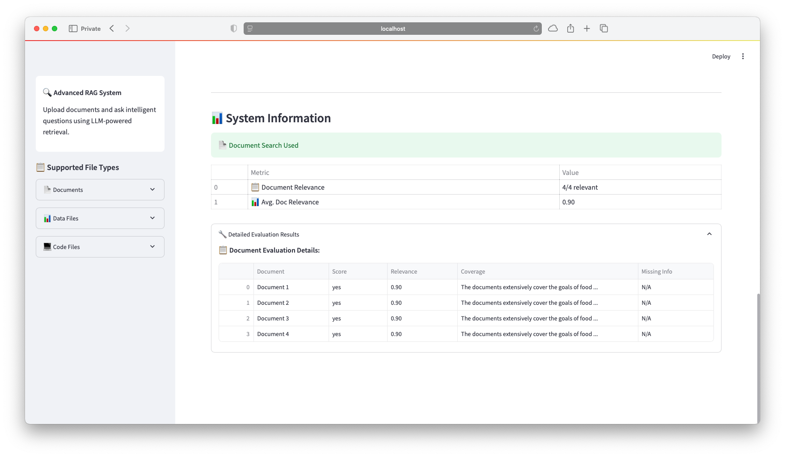
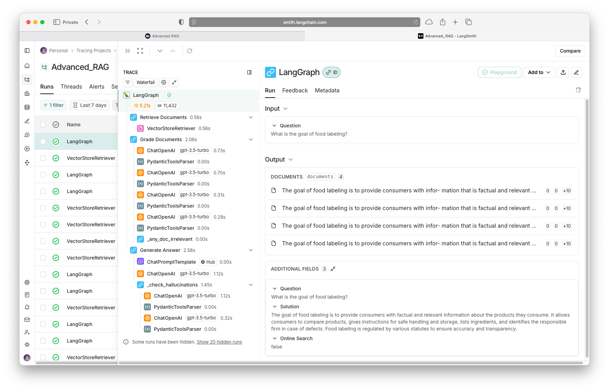

# 🔎 Advanced RAG with LangGraph

[](https://www.python.org/downloads/)
[](https://opensource.org/licenses/MIT)
[](https://streamlit.io/)
[](https://github.com/langchain-ai/langgraph)
[](https://python.langchain.com/)
[](https://www.trychroma.com/)

## 📖 Overview

A sophisticated Retrieval-Augmented Generation (RAG) system built with **LangGraph** for intelligent workflow orchestration, **Streamlit** for the web interface, and **ChromaDB** for vector storage. This application enables users to upload documents and ask intelligent questions, with automatic fallback to online search when document content is insufficient.

### ✨ Key Features

- 📁 **Multi-format Document Support**: PDF, Word, Excel, and Text files
- 🔍 **Intelligent Search**: Document-first approach with online search fallback
- 🎯 **Advanced Evaluation**: Comprehensive answer quality assessment
- 🔄 **LangGraph Workflow**: Robust state management and error handling
- 📊 **Transparency**: Detailed evaluation metrics and source attribution
- 🔗 **LangSmith Integration**: Optional workflow monitoring and debugging

## 🏗️ Architecture

This project demonstrates a production-ready RAG implementation using LangGraph for workflow orchestration:



### LangGraph RAG Pipeline

The system uses LangGraph to manage a sophisticated workflow with:

- **State Management**: Tracks questions, documents, and evaluation results throughout the pipeline
- **Conditional Routing**: Intelligently decides between document search and online search
- **Multi-step Validation**: Quality checks at each stage prevent hallucinations
- **Error Recovery**: Automatic fallback mechanisms ensure robust operation
- **Extensible Design**: Easy to modify and extend with new capabilities

## 🚀 Quick Start

### Prerequisites

- Python 3.11 or higher
- OpenAI API key
- Tavily API key (for web search)
- LangSmith API key (optional, for monitoring)

### Installation

1. **Clone the repository**
   ```bash
   git clone https://github.com/Adityadhadiwal/Advanced-RAG-LangGraph.git
   cd Advanced-RAG-LangGraph
   ```

2. **Create virtual environment**
   ```bash
   python -m venv rag_env
   source rag_env/bin/activate  # On Windows: rag_env\Scripts\activate
   ```

3. **Install dependencies**
   ```bash
   pip install --upgrade pip
   pip install -r requirements.txt
   ```

4. **Configure environment variables**
   
   Create a `.env` file in the project root:
   ```env
   OPENAI_API_KEY=your_openai_api_key_here
   TAVILY_API_KEY=your_tavily_api_key_here
   LANGCHAIN_API_KEY=your_langsmith_api_key_here  # Optional
   LANGCHAIN_TRACING_V2=true                      # Optional
   LANGCHAIN_PROJECT=Advanced-RAG-LangGraph       # Optional
   ```

5. **Launch the application**
   ```bash
   streamlit run app.py
   ```

   Open your browser to `http://localhost:8501`

## 🎯 How to Use

### Basic Workflow

1. **Upload Documents**
   - Drag and drop files or use the file uploader
   - Supported formats: PDF, DOCX, TXT, CSV, XLSX
   - Wait for processing completion

2. **Ask Questions**
   - Enter your question in the text input
   - Click "Ask" or press Enter
   - Review the generated answer with source attribution

3. **Review Evaluation Results**
   - Check document relevance scores
   - View evaluation metrics for answer quality
   - Understand which sources were used

### Advanced Features

- **System Information**: View detailed evaluation metrics and system transparency
- **LangSmith Monitoring**: Track workflow execution in real-time (if configured)
- **Fallback Search**: Automatic web search when documents don't contain answers

## 📁 Project Structure

```
Advanced-RAG-LangGraph/
├── app.py                    # Main Streamlit application
├── config.py                 # Configuration settings
├── utils.py                  # Utility functions
├── ui_components.py          # UI component definitions
├── document_processor.py     # Document processing logic
├── rag_workflow.py          # LangGraph RAG workflow
├── document_loader.py       # File loading and parsing
├── state.py                 # State management classes
├── requirements.txt         # Python dependencies
├── chains/                  # LangGraph components
│   ├── __init__.py
│   ├── document_relevance.py
│   ├── evaluate.py
│   ├── generate_answer.py
│   └── question_relevance.py
├── screenshots/             # Documentation images
└── .env.example            # Environment variables template
```

## 🛠️ Technical Implementation

### LangGraph Components

The RAG workflow is implemented using several key LangGraph patterns:

#### State Management
```python
class GraphState(TypedDict):
    question: str
    documents: List[Document]
    generation: str
    web_search: str
    evaluations: Dict[str, Any]
```

#### Conditional Routing
- Document relevance evaluation
- Question addressability assessment
- Hallucination detection
- Search method selection

#### Error Handling
- Graceful degradation on component failures
- Automatic retry mechanisms
- Comprehensive logging and monitoring

### Supported File Types

| Format | Extensions | Processing Method |
|--------|------------|-------------------|
| Text | `.txt` | Direct text extraction |
| PDF | `.pdf` | PyPDF2/pdfplumber |
| Word | `.docx` | python-docx |
| Excel | `.xlsx`, `.csv` | pandas |

## 📊 Evaluation Metrics

The system provides comprehensive evaluation across multiple dimensions:

### Document Evaluation
- **Relevance Score**: How well documents match the question
- **Coverage Assessment**: Completeness of information
- **Source Attribution**: Clear citation of information sources

### Answer Quality
- **Factual Accuracy**: Verification against source material
- **Completeness**: Whether all aspects of the question are addressed
- **Hallucination Detection**: Identification of unsupported claims

## 🔧 Configuration

### Environment Variables

| Variable | Required | Description |
|----------|----------|-------------|
| `OPENAI_API_KEY` | Yes | OpenAI API key for LLM |
| `TAVILY_API_KEY` | Yes | Tavily API key for web search |
| `LANGCHAIN_API_KEY` | No | LangSmith monitoring |
| `LANGCHAIN_TRACING_V2` | No | Enable LangSmith tracing |
| `LANGCHAIN_PROJECT` | No | LangSmith project name |

### Customization Options

The system can be customized through `config.py`:
- Model selection and parameters
- Chunk size and overlap settings
- Evaluation thresholds
- UI customization options

## 🚀 Deployment

### Local Development
```bash
streamlit run app.py
```

### Production Deployment

For production deployment, consider:

1. **Container Deployment**
   ```dockerfile
   FROM python:3.11-slim
   WORKDIR /app
   COPY requirements.txt .
   RUN pip install -r requirements.txt
   COPY . .
   CMD ["streamlit", "run", "app.py", "--server.port=8501", "--server.address=0.0.0.0"]
   ```

2. **Environment Configuration**
   - Use secrets management for API keys
   - Configure appropriate resource limits
   - Enable logging and monitoring

## 🔍 Troubleshooting

### Common Issues

**Application Won't Start**
- Verify Python version (3.11+)
- Check all dependencies are installed
- Ensure virtual environment is activated

**API Key Errors**
- Verify API keys are correct in `.env`
- Check OpenAI account has sufficient credits
- Validate Tavily API key is active

**Document Processing Issues**
- Ensure file formats are supported
- Check file size limitations
- Verify file integrity

**Performance Issues**
- Large documents take time to process
- Consider chunking strategy adjustments
- Monitor API rate limits

## 🤝 Contributing

Contributions are welcome! Please feel free to submit a Pull Request. For major changes, please open an issue first to discuss what you would like to change.

1. Fork the repository
2. Create a feature branch (`git checkout -b feature/AmazingFeature`)
3. Commit your changes (`git commit -m 'Add some AmazingFeature'`)
4. Push to the branch (`git push origin feature/AmazingFeature`)
5. Open a Pull Request

## 📄 License

This project is licensed under the MIT License - see the [LICENSE](LICENSE) file for details.

## 🙏 Acknowledgments

- [LangGraph](https://github.com/langchain-ai/langgraph) for workflow orchestration
- [Streamlit](https://streamlit.io/) for the web framework
- [ChromaDB](https://www.trychroma.com/) for vector storage
- [OpenAI](https://openai.com/) for language model capabilities
- [Tavily](https://tavily.com/) for web search functionality

## 📸 Screenshots

### Document Upload Interface


### Q&A Interface  


### Evaluation Results


### LangSmith Tracing


---

**Built with ❤️ using LangGraph, Streamlit, and ChromaDB**
